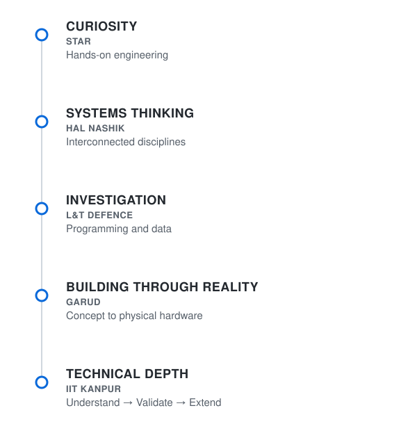
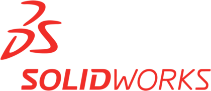
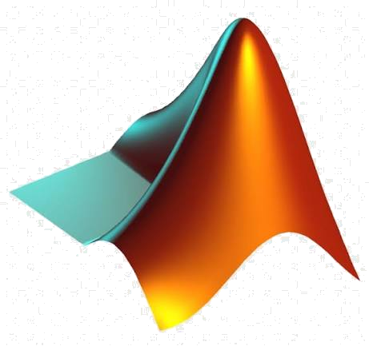
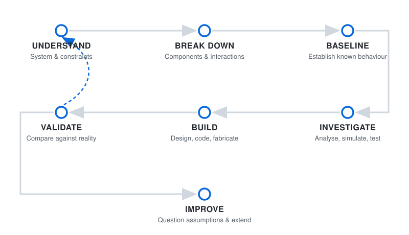

# Engineering begins where the obvious answer ends.

> Curious by nature, driven to grow beyond who I was yesterday, relentless in pursuit of what comes next, and always aware there is more to learn.

I am an engineer who enjoys understanding how complex systems work, then figuring out how to make them work better.

My journey has taken me through aerospace, defence, mechanical design, simulation, computation, programming, data, and hands-on engineering. On the surface, these experiences may appear to belong to different areas. To me, however, they have always been connected by the same thing: a curiosity about how complex systems work and a desire to understand more than what is immediately visible.

I enjoy moving between ideas and implementation: designing something, analysing it, building it, testing it, and then asking what could be improved. Sometimes that means designing a component. Sometimes it means writing code, analysing data, running a simulation, investigating an existing system, or building physical hardware.

Aerospace is where much of my journey began, but I have gradually realised that the subject itself is only part of the story. Engineering is the thread that connects everything I do. I am drawn to difficult problems, multidisciplinary systems, unfamiliar tools, and the process of gradually becoming capable of doing things that once seemed beyond me.

---

## HOW I GOT HERE

### 01 | WHERE IT STARTED
**Curiosity needed somewhere to go**

My first real exposure to engineering beyond the classroom came through Space Technology and Aeronautical Rocketry (STAR).

Until then, engineering had largely existed as equations, theories, and problems with known answers. STAR changed that. For the first time, I was around systems that had to be assembled, tested, understood, and made to work.

It taught me something that has stayed with me: there is a difference between understanding how something should work and actually making it work. Things do not always fit perfectly, components interact in unexpected ways, and systems can behave differently in reality than they do on paper.

This was where engineering became an iterative process for me: understanding, experimenting, failing, improving, and trying again. It was also where curiosity became something I could build with.

### 02 | WHEN ENGINEERING BECAME REAL
**Seeing the scale behind the system**

My experience at HAL Nashik was one of the moments when engineering became real in a completely different way.

I had studied aircraft systems and components before, but seeing large, complex aerospace systems up close gave me a different perspective. I was able to observe environments involving aircraft, propulsion, structures, avionics, radar systems, subsystem integration and overhaul operations. For the first time, the individual topics I had encountered in my studies began to feel like parts of a much larger whole.

What stood out to me was that a complex engineering product does not exist because one component was designed well. It exists because an enormous number of decisions, processes and systems have to work together.

Design is connected to manufacturing. Manufacturing is connected to assembly. Assembly is connected to inspection and integration. Integration is connected to testing, maintenance, reliability and long-term operation.

That was an important shift in how I viewed engineering. I began to think less about individual components in isolation and more about systems.

My experience at HAL also made me appreciate the engineering behind things that are easy to overlook from a distance. An aircraft in flight is the visible result of a much larger ecosystem of design, production, inspection, integration, maintenance and human expertise.

Aerospace was the environment in which I saw this, but the lesson itself was broader: real engineering happens at the interfaces between disciplines.

### 03 | FOLLOWING CURIOSITY FURTHER
**When a requirement became an investigation**

At L&T Defence, I worked on a research problem involving VTOL UAVs. The original task was relatively straightforward: investigate existing systems and use the available information to support the development of requirements.

But I found it difficult to stop there.

I wanted to understand the wider design space rather than simply collect a few examples and produce an average specification. The more I looked at existing platforms, the more questions appeared. Why did some aircraft have particular configurations? How were payload, endurance, dimensions, propulsion and mission requirements related? What trade-offs were different designers making?

What began as a requirement study gradually became a larger investigation.

Using Python and SQL, I built and worked with a structured database of more than 170 VTOL UAV platforms. The goal was not simply to collect specifications. I wanted a framework that could be explored, queried and compared in a way that helped reveal patterns across the existing landscape.

This experience was important because it introduced me to programming and data as engineering tools. Python and SQL were not being used in isolation; they became part of the process of understanding a technical problem.

It also reinforced something that has followed me through later projects: the original question is not always the whole problem.

Sometimes the most useful thing you can do is pause, look beyond the immediate requirement, and ask whether there is a better way to understand the system before making a decision.

### 04 | GARUD
**Thrust-Vector-Controlled Model Rocket**

GARUD was where several parts of my engineering journey came together.

The project began with an ambitious idea: develop a thrust-vector-controlled model rocket and take it through the journey from concept toward a functioning physical system.

That meant dealing with engineering as a chain rather than a collection of separate tasks:

concept → simulation → design → analysis → fabrication → integration → testing

Different stages required different tools and different ways of thinking. We worked with trajectory and flight analysis, CAD design, structural considerations, modelling and control-related work, fabrication and the integration of physical hardware.

But the most valuable part of GARUD was what happened between those stages.

A model can look correct on a computer while being difficult to manufacture. A design can work individually while creating integration problems when combined with other components. Parts that appear to fit digitally still have to deal with tolerances, fabrication limitations, assembly, wiring, hardware constraints and the practical uncertainty that comes with building something real.

GARUD forced me to think about engineering as an end-to-end process.

The goal was no longer simply to create a good CAD model or complete an analysis. Every decision eventually had to survive the transition to physical hardware. Design had to communicate with fabrication. Fabrication had to communicate with integration. Integration had to communicate with testing.

That is why GARUD remains one of the strongest experiences in my journey.

The application was a rocket, but what I learned was much broader: engineering becomes most interesting when an idea has to survive reality.

### 05 | IIT KANPUR
**Choosing the Harder Room**

Coming to IIT Kanpur was a deliberate decision to place myself in a more demanding environment.

I did not come expecting to already know enough. I came because I wanted to be around harder problems, stronger technical foundations, and people who could challenge the way I thought.

That experience has changed the way I approach engineering problems.

My current work involves computational engineering and fluid mechanics, but one principle has become increasingly important to me:

Before trying to change a complex system, first understand it.

When working with an existing computational workflow, the temptation can be to immediately modify the code, add a new feature or move toward the final objective. I have learned that this can be the wrong place to begin.

First understand the system.

Understand how the pieces are connected. Establish a baseline. Reproduce known behaviour. Validate against trusted reference data. Question assumptions. Find out what the existing implementation is actually doing before deciding what should be changed.

Only then is there a trustworthy foundation for extending the work.

This way of thinking now goes beyond computational research for me. Whether I am looking at a physical system, a CAD design, a dataset or a large codebase, I increasingly believe that understanding is an engineering tool in itself.

IIT Kanpur is the current chapter of that journey. It represents not an endpoint, but a willingness to keep choosing environments and problems that demand more from me than the version of myself that arrived there.

---

## WHAT I WORK WITH

The tools change with the problem. The approach does not: understand the system, break the problem down, and keep going until the next question is worth asking.

**Design & Engineering**  
 
 &nbsp;&nbsp;  &nbsp;&nbsp;  &nbsp;&nbsp;  &nbsp;&nbsp; 
  

**Simulation & Analysis**  
 
 &nbsp;&nbsp;  &nbsp;&nbsp;  &nbsp;&nbsp;  &nbsp;&nbsp; 
  

**Programming & Computing**  
 
 &nbsp;&nbsp;  &nbsp;&nbsp;  &nbsp;&nbsp;  &nbsp;&nbsp; 
  

**Data & Workflow**  
 
 &nbsp;&nbsp;  &nbsp;&nbsp;  &nbsp;&nbsp; 
  

---

## HOW I APPROACH ENGINEERING

The tools change with the problem, but the process remains consistent: understand what exists, investigate what matters, build carefully, validate against evidence, and improve from what you learn.

---

## WHAT I HAVE BUILT

| 🚀 [**Project GARUD**](https://github.com/Tanish0224/garud-tvc-rocket) |
| :--- |
| **Thrust-Vector-Controlled Model Rocket**   A complete engineering lifecycle project moving from concept and trajectory simulation through to physical fabrication, hardware integration, and testing. |

---

## HOW TO REACH ME

**[LinkedIn](https://www.linkedin.com/in/tanish-shetty02/)** &nbsp;&nbsp;•&nbsp;&nbsp; **[Email](mailto:tanish.shetty2002@gmail.com)** &nbsp;&nbsp;•&nbsp;&nbsp; **[GitHub](https://github.com/Tanish0224)**

