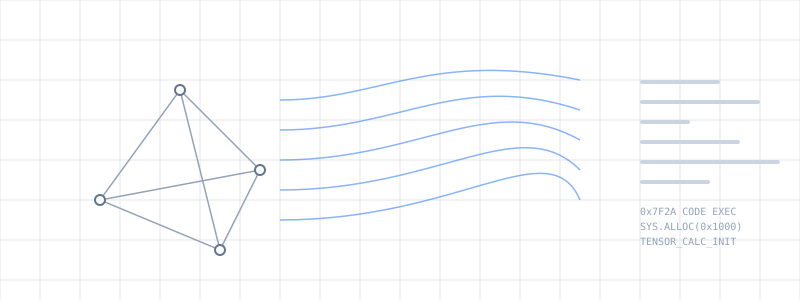
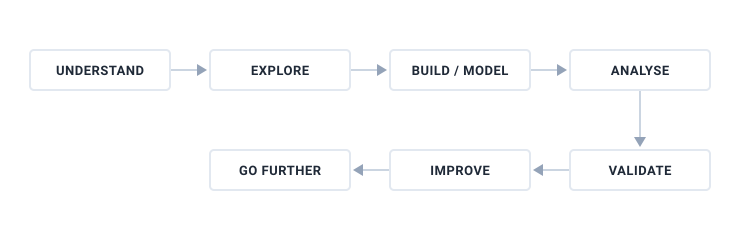
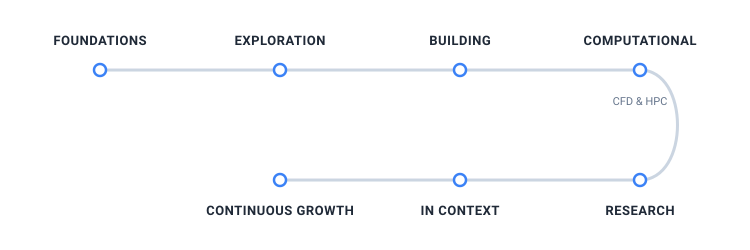
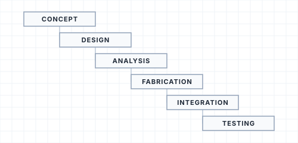
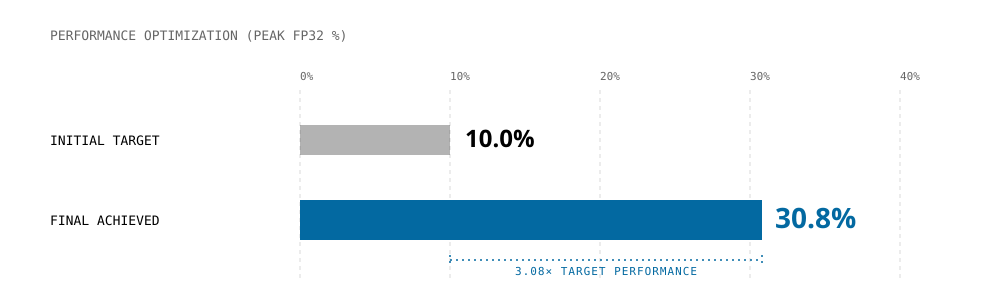
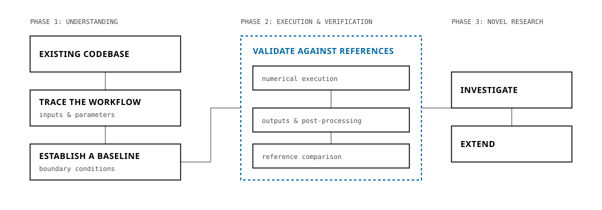
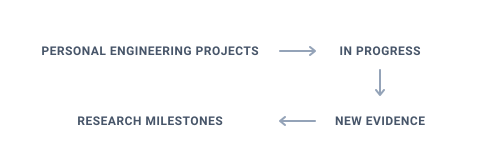

# Tanish Shetty

Aerospace-trained engineer working across physical systems, design, computation and research.

I tend to take engineering work beyond the first acceptable answer—understanding the system, exploring further, building or modelling, validating the result and improving what comes next.

---

## The Way I Work

Across projects, a consistent pattern has emerged in how I approach engineering problems: understand the system, explore beyond the initial requirement, build or model the solution, analyse the results, validate assumptions, improve the work and continue from there.

---

## Engineering Journey

The path has changed with each experience, but the underlying pattern has remained consistent: understanding complex systems, moving across disciplines and taking the work further than the initial requirement.

---

## Exploration Beyond the Classroom

Before I started building my own larger engineering projects, I deliberately explored different sides of engineering beyond the classroom. Each experience exposed me to a different layer of how complex systems are researched, designed, integrated and realised.

### 01 — L&T Defence

**RESEARCH → DATA → SYSTEMS**

I began with a structured research problem around VTOL UAVs. Rather than treating the initial dataset as the final deliverable, I expanded the investigation, building a broader database of more than 170 platforms and using Python and SQL to explore relationships between platform characteristics.

**What this added to my engineering approach:** the ability to move from scattered information to a structured engineering dataset, then use that dataset to investigate the system more deeply.

### 02 — Avionics & Radar

**SYSTEMS → INTEGRATION → REALITY**

An avionics environment gave me exposure to radar systems, subsystem integration and overhaul workflows. The experience shifted my perspective from isolated components toward the interfaces, dependencies and engineering processes required to make complex systems work together.

**What this added to my engineering approach:** a stronger understanding that engineering systems are defined not only by individual components, but by how those components interact, integrate and are maintained.

### 03 — CubeSat Structures

**CONSTRAINTS → DESIGN → ITERATION**

Working on the structural design of a 1U CubeSat introduced a more constrained design problem: develop a physical structure while accounting for geometry, mass and structural requirements. The work involved CAD development and iterative engineering decisions within those limitations.

**What this added to my engineering approach:** designing within constraints and treating iteration as part of engineering rather than a sign that the first solution failed.

Exploration gave me exposure to different engineering environments. The next stage was taking greater ownership of the work itself—building systems, improving computational performance and investigating engineering problems beyond the immediate technical boundary.

---

## Featured Engineering Stories

### GARUD — From Concept to Physical Reality

*Thrust Vector Control Model Rocket*

A complete engineering system from concept to physical testing.

GARUD began as a final-year project to design, analyse, fabricate and test a thrust-vector-controlled model rocket. The project required more than developing a single design or simulation model: the challenge was to connect the complete engineering chain—from defining the system and developing the design to analysing its behaviour, fabricating components, integrating the physical system and carrying the work through testing.

The work brought together multiple engineering tools and disciplines, including **SolidWorks for design, MATLAB and Simulink for modelling and control-related work, and RockSim for rocket trajectory and flight analysis**. Moving between these stages made the project a practical exercise in handling the trade-offs between what can be designed, what can be analysed, and what can actually be fabricated and integrated.

**What this strengthened in my engineering approach:** taking ownership of an engineering problem across the full development cycle and understanding that a design is not complete when the model works—it must survive the transition from concept to analysis, fabrication, integration and testing.

### Beyond the First Working Version

*Turning a CFD Solver into a GPU Performance Engineering Problem*

A working computational model was only the starting point.

The project began with an existing CFD solver implemented for CPU execution. I first worked to understand the computational structure of the solver and establish a baseline before moving the workload toward GPU execution. The first GPU implementation demonstrated the obvious benefit of parallel hardware—but also revealed an important engineering lesson: **simply parallelising a computation does not automatically produce an efficient implementation.**

The next stage became a performance investigation. I compared CPU and GPU execution, measured performance, examined where computational resources were being lost, and used profiling to identify the parts of the implementation limiting performance.

From there, the work moved through successive optimisation stages. Instead of making arbitrary changes, each step followed a cycle:

**BASELINE → MEASURE → IDENTIFY THE BOTTLENECK → OPTIMISE → VALIDATE**

The goal was initially to reach approximately **10% of peak FP32 performance**. Through iterative optimisation, the implementation ultimately reached approximately **30.8% of peak FP32 performance**—more than three times the original target.

The result mattered less than the number itself and more because of what the process demonstrated: performance improvement was treated as an engineering problem. A working solution became a baseline; measurements identified the limitations; targeted changes addressed those limitations; and the final implementation was validated against measurable performance.

**What this strengthened in my engineering approach:** I learned not to optimise blindly. First understand the system, establish evidence, identify the real bottleneck, make targeted changes and then verify whether the result genuinely improved.

### Beyond the Aircraft

*Tracing How Engineering Capability Is Built Around the Product*

Aerospace products do not emerge from engineering design alone. They depend on the ecosystem behind the product: manufacturing capability, technology access, supplier networks, industrial partnerships and long-term localisation.

For my 2023 project on **India’s Emerging Aerospace Ecosystem**, I moved beyond analysing individual aircraft or technologies and investigated the wider ecosystem supporting aerospace capability in India.

The work examined how major aerospace companies were establishing and expanding their presence through industrial partnerships and manufacturing relationships. I investigated examples involving **GE Aerospace and HAL, Airbus and Tata, and Boeing and Tata**, using these relationships to understand how technology, manufacturing capability, localisation and supply chains can develop together.

The project connected multiple layers of the same question:

**TECHNOLOGY → PARTNERSHIPS → MANUFACTURING → LOCAL CAPABILITY → INDUSTRIAL ECOSYSTEM**

What made the project valuable to my engineering perspective was that it changed how I thought about technology itself. A technically advanced product is only one part of engineering capability. The ability to design, manufacture, integrate, support and progressively develop that technology depends on the ecosystem surrounding it.

**What this strengthened in my engineering approach:** the ability to look beyond the individual component or product and understand the larger system—manufacturing, supply chains, partnerships and capability development—that determines whether engineering technology can be sustained and scaled.

---

## Understanding Before Extending

*Tracing, validating and extending a complex CFD research workflow*

**M.Tech Aerospace Engineering — IIT Kanpur | Computational Fluid Dynamics**

My current research began with an existing computational workflow rather than a blank page. Before extending the work toward contrail and ice-formation research, I first needed to understand how the simulation itself worked as a connected system.

I am tracing the workflow from simulation inputs and parameter handling through boundary-condition generation, numerical execution and output to the validation and post-processing stage. The immediate objective is to establish a trustworthy and reproducible baseline for turbulent-jet simulations before building further on the research.

The work is therefore progressing through:

**EXISTING CODEBASE → TRACE THE WORKFLOW → ESTABLISH A BASELINE → VALIDATE AGAINST REFERENCES → INVESTIGATE → EXTEND**

**Current focus:** reproducing and validating turbulent-jet results against established reference data before moving toward the next stage of the research.

**[ Research in progress ]**

---

## Tools I Use Along the Way

**Design & Engineering**  
SolidWorks · Siemens NX · Fusion 360 · RockSim

**Simulation & Analysis**  
ANSYS · Fluent · Mechanical · MATLAB · Simulink

**Computational Engineering**  
Python · C/C++ · CUDA/GPU computing · HPC · MPI

**Research & Data**  
Python · SQL · Pandas · Excel · Technical documentation

---

## What I'm Building Next

This is not a finished archive. It is an evolving engineering record, with new projects and deeper technical work added as the journey continues.

---

## Connect

- [GitHub](https://github.com/Tanish0224)
