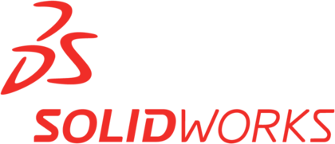
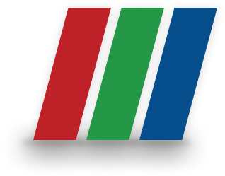
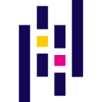
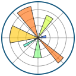

# Engineering begins where the obvious answer ends.

I am an engineer who enjoys understanding how complex systems work, then figuring out how to make them work better.

My journey has taken me through aerospace, defense, mechanical design, simulation, computation, programming, data, and hands-on engineering. On the surface, these experiences may appear distinct. To me, however, they are connected by a single thread: **a desire to understand more than what is immediately visible.**

I enjoy moving between ideas and implementation—designing a component, writing code, analyzing data, running a simulation, or building physical hardware. Regardless of the tool, the process remains the same: design, analyze, build, test, and ask what can be improved.

Aerospace is where my journey began, but I am drawn to difficult problems and multidisciplinary systems across domains. Engineering is the thread that connects everything I do.

---

## HOW I GOT HERE

### 01 | WHERE IT STARTED
**Curiosity needed somewhere to go**

My first real exposure to engineering beyond the classroom came through Space Technology and Aeronautical Rocketry (STAR). Until then, engineering had largely existed as equations, theories, and problems with known answers. STAR changed that. 

For the first time, I was around systems that had to be assembled, tested, and made to work. It taught me a lesson that has stayed with me: **there is a difference between understanding how something should work and actually making it work.** 

Things do not always fit perfectly, components interact in unexpected ways, and physical systems behave differently than they do on paper. This was where engineering became an iterative process for me: understanding, experimenting, failing, improving, and trying again.

### 02 | WHEN ENGINEERING BECAME REAL
**Seeing the scale behind the system**

My experience at HAL Nashik gave me a different perspective. I had studied aircraft systems and components before, but seeing large aerospace systems up close showed me how individual disciplines fit into a much larger whole. 

I was exposed to environments involving aircraft propulsion, structures, avionics, radar systems, subsystem integration, and overhaul operations. What stood out was that a complex engineering product does not exist simply because one component is designed well. It exists because the entire system works together:

*   **Design & Manufacturing**
*   **Assembly & Inspection**
*   **Integration, Testing & Maintenance**

That shifted how I viewed engineering. I began thinking less about individual components in isolation and more about the systems and interfaces connecting them. Real engineering happens at the interfaces between disciplines.

### 03 | FOLLOWING CURIOSITY FURTHER
**When a requirement became an investigation**

At L&T Defence, I worked on a research problem involving VTOL UAVs. The original task was to study existing systems and use that information to support requirement development.

However, I wanted to understand the wider design space rather than simply collect examples. I asked broader questions:
*   Why did different aircraft use particular configurations?
*   How were payload, endurance, dimensions, and propulsion related?
*   What trade-offs were designers making?

What began as a requirement study became a larger investigation. Using Python and SQL, I built a structured database containing **approximately 195 usable VTOL UAV records from more than 200 researched platforms**. 

This allowed the data to be queried and compared to identify patterns across the design space. It reinforced a lesson that has followed me since: the original question is not always the whole problem. Sometimes you need to look beyond the immediate requirement before deciding what the system is really telling you.

### 04 | GARUD
**Thrust-Vector-Controlled Model Rocket**

GARUD was where several parts of my engineering journey came together. Collaborating within a four-member team, we set out to develop a thrust-vector-controlled (TVC) model rocket and take it from concept to a functioning physical system. 

That meant treating engineering as a connected chain rather than a collection of separate tasks:
*   **Concept & Simulation**
*   **Design & Analysis**
*   **Fabrication & Integration**
*   **Testing**

While the team tackled trajectory analysis, structural considerations, and control modeling, I took specific ownership of the **mechanical and CAD design**—focusing on the TVC mechanism and the deployable landing-leg assembly.

The most valuable part of GARUD was what happened between the development stages. A digital CAD model can look correct on a screen but be impossible to manufacture. Parts that fit perfectly in software must still account for physical tolerances, wiring, and assembly constraints. GARUD forced me to think about engineering as an end-to-end process where every decision eventually has to survive the transition to physical hardware. 

### 05 | IIT KANPUR
**Choosing the Harder Room**

Coming to IIT Kanpur was a deliberate decision to place myself in a more demanding environment. I came to work on harder problems, build stronger technical foundations, and be challenged by people and ideas that change the way I think.

My current work involves computational engineering and fluid mechanics, but one principle has become increasingly important to me: **before trying to change a complex system, first understand it.**

Whether working with an existing computational workflow, a physical system, a CAD design, a dataset, or a large codebase, the temptation is often to immediately modify something. I have learned to follow a more rigorous sequence:
*   **Understand** how the pieces are connected.
*   **Establish a baseline** and reproduce known behavior.
*   **Validate** the model against evidence.
*   **Question assumptions** and find out what the existing system is *actually* doing.

Only then is there a trustworthy foundation for extending the work. IIT Kanpur is the current chapter of that journey—a willingness to keep choosing problems that demand more from me than the version of myself that arrived here.

---

## WHAT I WORK WITH

The tools change with the problem. The approach does not: understand the system, break the problem down, and keep going until the next question is worth asking.

**Design & Engineering**  
 
 &nbsp;&nbsp;  &nbsp;&nbsp;  &nbsp;&nbsp;  &nbsp;&nbsp; 
  

**Simulation & Analysis**  
 
 &nbsp;&nbsp;  &nbsp;&nbsp;  &nbsp;&nbsp;  &nbsp;&nbsp; 
  

**Programming & Computing**  
 
 &nbsp;&nbsp;  &nbsp;&nbsp;  &nbsp;&nbsp;  &nbsp;&nbsp; 
  

**Data & Workflow**  
 
 &nbsp;&nbsp;  &nbsp;&nbsp;  &nbsp;&nbsp;  &nbsp;&nbsp;  &nbsp;&nbsp; 
  

---

## KEY PROJECTS

| 🚀 [**Project GARUD**](https://github.com/Tanish0224/garud-tvc-rocket) |
| :--- |
| **Thrust-Vector-Controlled Model Rocket**   Represents multidisciplinary systems engineering, mechanical/CAD design, fabrication, and physical hardware integration. |

 

| ⚡ [**GPU-Accelerated CFD**](https://github.com/Tanish0224/gpu-accelerated-cfd) |
| :--- |
| **High-Performance GPU Compressible Flow Solver**   Represents computational engineering, HPC, GPU programming, CUDA, CuPy, and performance optimization. |

 

| 🚁 [**VTOL UAV Performance Analysis**](https://github.com/Tanish0224/vtol-uav-performance-analysis) |
| :--- |
| **Aerospace Systems Design Investigation**   Represents aerospace systems research, Python, SQL, databases, and data-driven engineering analysis. |

---

## HOW TO REACH ME

**[LinkedIn](https://www.linkedin.com/in/tanish-shetty02/)** &nbsp;&nbsp;•&nbsp;&nbsp; **[Email](mailto:tanish.shetty2002@gmail.com)** &nbsp;&nbsp;•&nbsp;&nbsp; **[GitHub](https://github.com/Tanish0224)**
